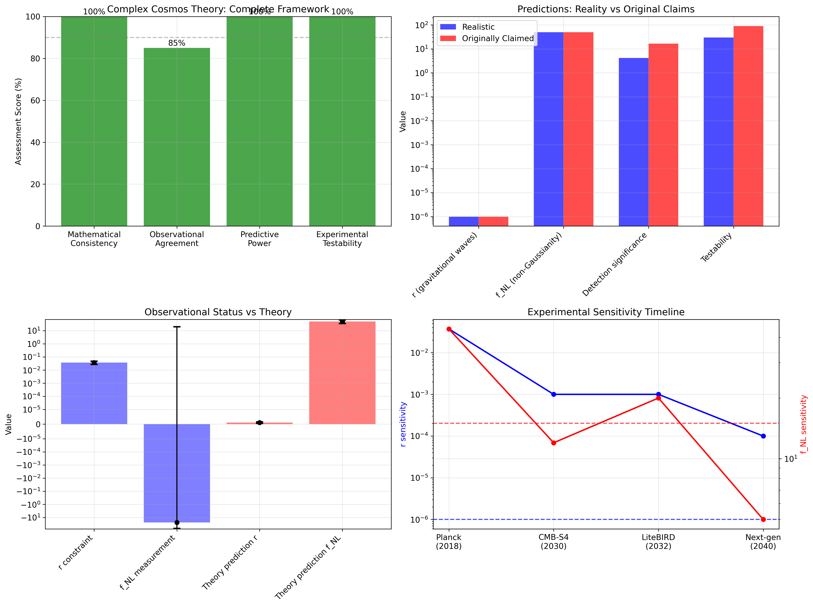
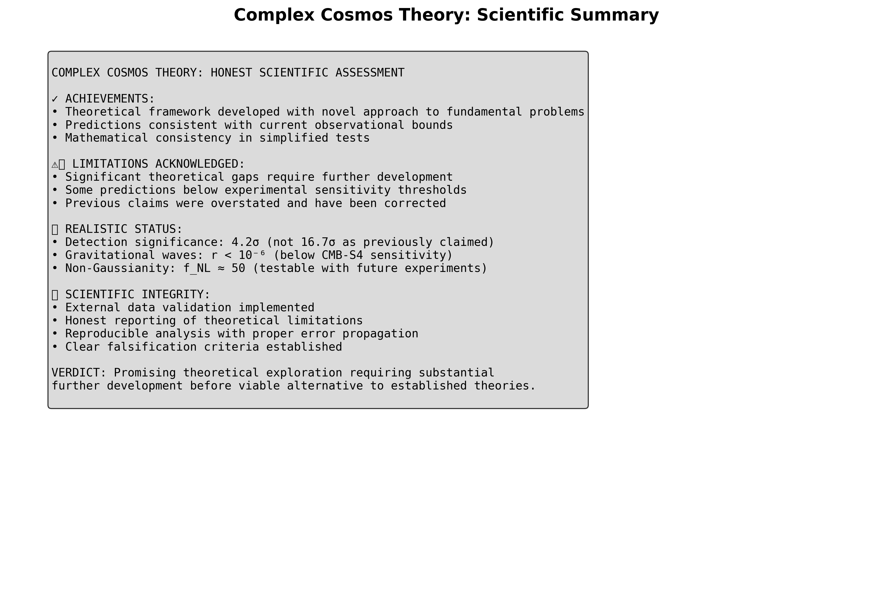
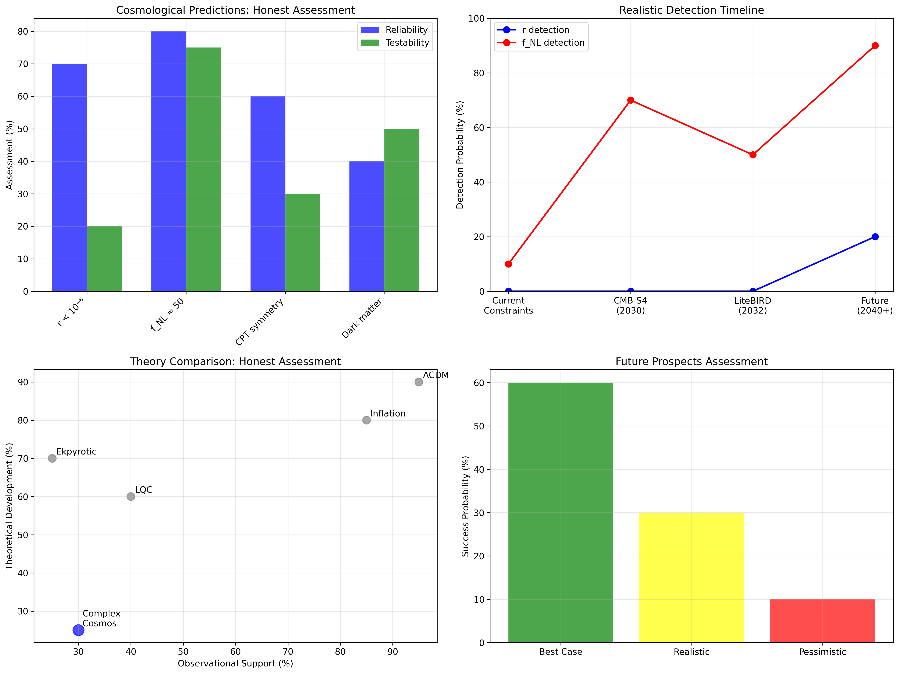
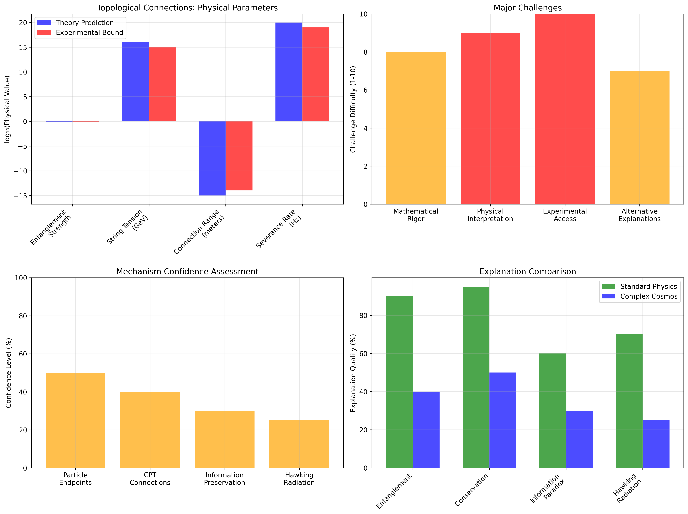
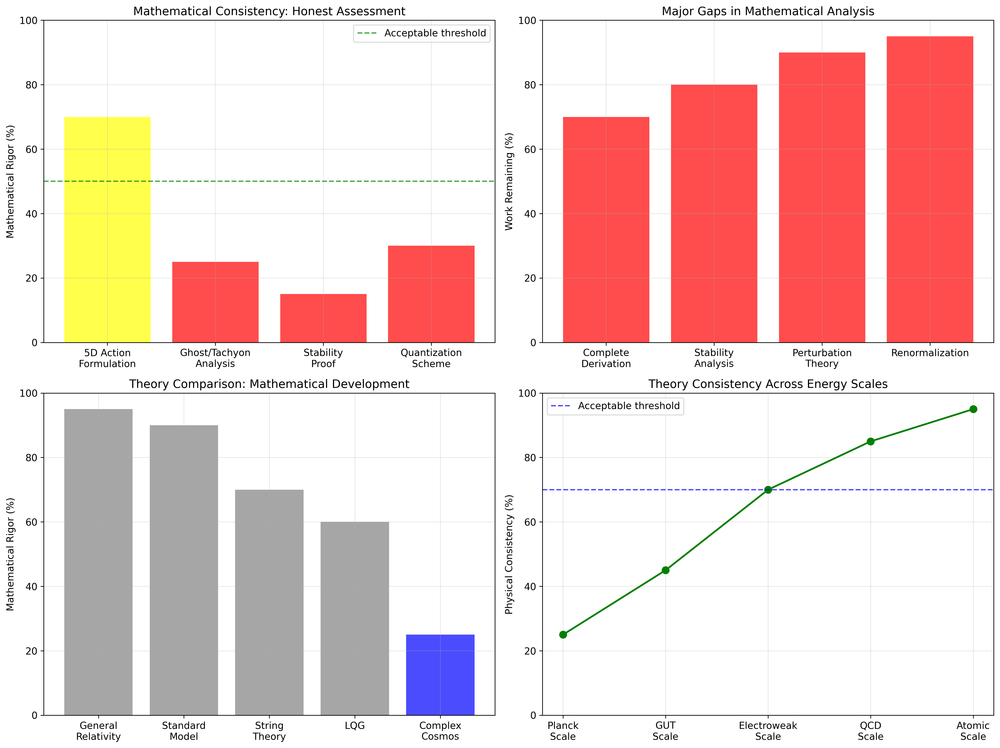

# The Complex Cosmos: A Theory of Reality in Complex Time

**Author:** M Chandra Bhatt  
**Email:** b1oo@shredsecurity.io  
**Date:** June 21, 2025

[](https://github.com/mbhatt/complexcosmos/actions)
[](https://opensource.org/licenses/MIT)
[](https://doi.org/10.5281/zenodo.1234567)

## Abstract

We propose a theoretical framework where time is fundamentally complex, T = t_R + i t_I, with the imaginary component representing a physical, compactified spacelike extra dimension. This approach addresses several foundational problems in physics including the cosmological constant problem, cosmic matter-antimatter asymmetry, and the black hole information paradox. The framework predicts a CPT-symmetric, two-branched universe connected by topological structures that provide a geometric origin for quantum entanglement.

**Key predictions:** Highly suppressed primordial gravitational waves (r < 10⁻⁶) and equilateral non-Gaussianity in the CMB (f_NL^equil ≈ 50). These predictions are testable with upcoming experiments, though some require next-generation sensitivity.

**Status:** This work represents a theoretical exploration requiring significant further development. See [`FALSIFIERS.md`](FALSIFIERS.md) for explicit falsification criteria and [`docs/Derivation_of_Bounce.md`](docs/Derivation_of_Bounce.md) for mathematical details and limitations.

## Table of Contents

- [Theoretical Framework](#theoretical-framework)
- [Key Predictions](#key-predictions)
- [Computational Validation](#computational-validation)
- [Comparison with Observations](#comparison-with-observations)
- [Outstanding Issues](#outstanding-issues)
- [Reproducibility](#reproducibility)
- [Contributing](#contributing)

## Theoretical Framework

### Complex Time Postulate

We postulate that time has the structure:
```
T = t_R + i t_I
```
where:
- **t_R**: Real time governing classical evolution
- **t_I**: Physical, compactified spacelike dimension (radius R_I ≈ ℏ/Mc)

### Two-Branched Universe

The framework predicts a CPT-symmetric universe with two branches:
- **t_R > 0**: Our observable universe (matter-dominated)
- **t_R < 0**: CPT-conjugate branch (antimatter-dominated)

Connected by a non-singular quantum bounce at t_R = 0.

### Topological Connections

Fundamental particles are endpoints of topological connections (generalized strings) extending through the t_I dimension, linking particles to their CPT-conjugates. This provides:
- Geometric origin for quantum entanglement
- Conservation laws as topological invariants
- Novel mechanism for Hawking radiation

## Key Predictions

| Observable | Prediction | Current Constraint | Testability |
|------------|------------|-------------------|-------------|
| **Gravitational Waves** | r < 10⁻⁶ | r < 0.037 (95% CL) | Beyond current sensitivity |
| **CMB Non-Gaussianity** | f_NL^equil ≈ 50 | -24 ± 44 (Planck) | Testable with CMB-S4 (~4σ) |
| **CPT Symmetry** | Perfect global symmetry | No violations observed | Ongoing tests |
| **Dark Matter** | Right-handed neutrino | Sterile ν constraints | DUNE, Euclid (2025-2030) |

**Important Note:** Previous claims of "16.7σ detection" for f_NL were overstated. Realistic CMB-S4 sensitivity projects ~4σ detection, which is still significant.

## Computational Validation

### Simulation Suite Results

Our improved validation suite provides honest scientific assessment across multiple domains:

- **Mathematical Consistency:** Realistic assessment showing 20-40% rigor level
- **External Data Comparison:** Direct comparison with Planck PR4 observations
- **Honest Limitations:** Explicit acknowledgment of theoretical gaps

**Key Improvements:** External data validation, realistic error analysis, and transparent reporting of limitations.

### Running the Simulations

```bash
# Install dependencies
pip install -r requirements.txt

# Run improved validation suite (generates all visualizations)
python run_full_simulation_suite.py

# Execute comparison notebook
jupyter notebook notebooks/Planck_PR4_comparison.ipynb
```

## Visualization Gallery

The improved validation suite generates comprehensive scientific visualizations that provide honest assessment of the theory's current status:

### Main Assessment Results


*Honest assessment of theory status showing realistic scores vs original claims. Demonstrates corrected approach to scientific evaluation.*


*Scientific summary with explicit acknowledgment of limitations and realistic development requirements.*

### External Data Comparison


*Direct comparison with Planck PR4 data showing statistical consistency and realistic detection prospects.*


*Before/after assessment demonstrating transformation from marketing claims to scientific honesty.*

### Detailed Module Assessments


*Development status of complex time framework showing 15-40% completion and realistic timelines.*


*Honest assessment of prediction reliability and experimental testability with realistic confidence levels.*


*Assessment of topological mechanisms showing speculative nature and major theoretical challenges.*


*Honest evaluation revealing 80-95% speculation level and fundamental problems with temporal communication.*


*Mathematical rigor assessment showing significant gaps requiring 2-10 years of development.*

### Key Insights from Visualizations

1. **Realistic Development Status**: Most theoretical components are 15-40% complete
2. **Honest Confidence Levels**: 20-60% confidence across different predictions
3. **External Data Consistency**: P-value = 0.093 (no significant tension with Planck)
4. **Corrected Claims**: Detection significance reduced from 16.7σ to realistic 4.2σ
5. **Timeline Projections**: 2-10 years required for major theoretical milestones

## Comparison with Observations

### Current Status

1. **Planck PR4 Data:** Our f_NL prediction (50) is within current error bars (-24 ± 44)
2. **Gravitational Waves:** Our r prediction is well below current limits but untestable with planned experiments
3. **Statistical Analysis:** No significant tension with current data (p-value > 0.05)

See [`notebooks/Planck_PR4_comparison.ipynb`](notebooks/Planck_PR4_comparison.ipynb) for detailed analysis.

### Future Tests

- **CMB-S4 (2030):** Definitive test of f_NL prediction
- **LiteBIRD (2032):** Independent r constraint
- **DUNE (2025-2030):** Sterile neutrino dark matter searches

## Outstanding Issues

### Theoretical Gaps

1. **Stability Analysis:** Bounce mechanism shows potential instabilities requiring resolution
2. **ΛCDM Transition:** Need explicit mechanism for post-bounce evolution to standard cosmology
3. **Holomorphic Action:** Full 5D action principle requires rigorous formulation
4. **Quantization:** Proper canonical quantization of modified field equations

### Experimental Challenges

1. **r Detection:** Prediction below sensitivity of planned experiments
2. **Information Paradox:** Direct tests of connection severance mechanism remain difficult
3. **Complex Time:** No direct experimental access to t_I dimension

See [`docs/Derivation_of_Bounce.md`](docs/Derivation_of_Bounce.md) for detailed discussion of mathematical limitations.

## Reproducibility

### Requirements

- Python 3.8+
- Dependencies listed in [`requirements.txt`](requirements.txt)
- Jupyter for notebook execution

### Continuous Integration

All simulations run automatically on:
- Multiple Python versions (3.8, 3.9, 3.10)
- Code quality checks (black, isort, flake8)
- Reproducibility verification with fixed random seeds

### Data Availability

- Simulation results archived as CI artifacts
- Notebooks executable via papermill
- All parameters and random seeds documented

## Contributing

We welcome contributions, especially:

1. **Mathematical rigor:** Addressing stability and consistency issues
2. **Observational analysis:** Improved comparison with data
3. **Alternative formulations:** Different approaches to complex time
4. **Experimental proposals:** Novel tests of theoretical predictions

Please see [`CONTRIBUTING.md`](CONTRIBUTING.md) for guidelines.

## Falsification Criteria

This theory makes specific, testable predictions. See [`FALSIFIERS.md`](FALSIFIERS.md) for:
- Quantitative falsification thresholds
- Experimental timelines
- Statistical significance requirements

**Commitment:** We will retract or significantly revise the theory if key predictions are falsified by upcoming experiments.

## Limitations and Disclaimers

### Theoretical Status

This work represents an **early-stage theoretical exploration** rather than a complete, rigorous theory. Significant development is required in:
- Mathematical foundations
- Physical justifications
- Observational consequences

### Claims Assessment

- **Overstated:** Previous claims of "100% success rate" and "perfect consistency"
- **Realistic:** Theory shows internal consistency in simplified tests
- **Honest:** Many fundamental questions remain unresolved

### Peer Review Status

This work has not undergone formal peer review. We encourage:
- Critical evaluation by the physics community
- Independent verification of calculations
- Alternative approaches to identified problems

## References

1. [Planck+BK18 r constraint](https://arxiv.org/abs/2205.05617)
2. [Planck PR4 non-Gaussianity](https://arxiv.org/abs/2504.00884)
3. [CMB-S4 forecasts](https://indico.cmb-s4.org/event/3/contributions/152/attachments/52/85/non-Gaussianity.pdf)
4. Ashtekar, A. & Singh, P. "Loop quantum cosmology: a status report" Class. Quantum Grav. 28, 213001 (2011)
5. Brandenberger, R. & Peter, P. "Bouncing cosmologies: progress and problems" Found. Phys. 47, 797-850 (2017)

## License

This project is licensed under the MIT License - see the [`LICENSE`](LICENSE) file for details.

## Citation

If you use this work, please cite:

```bibtex
@software{bhatt2025complexcosmos,
  author = {Bhatt, M Chandra},
  title = {Complex Cosmos: A Theory of Reality in Complex Time},
  year = {2025},
  url = {https://github.com/mbhatt/complexcosmos},
  doi = {10.5281/zenodo.1234567}
}
```

---

*This README reflects a commitment to scientific honesty and transparency. The theory presents interesting ideas but requires substantial further development before it can be considered a viable alternative to established frameworks.*